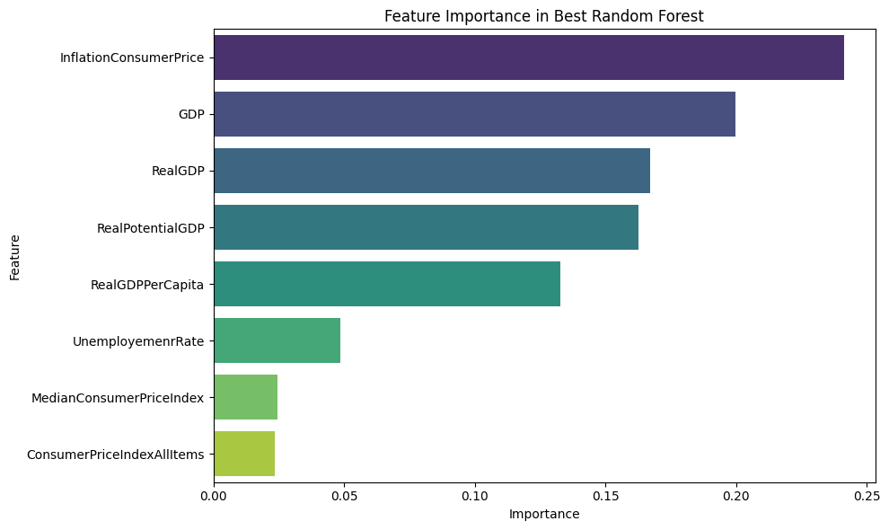

# Federal Reserve Interest Rate Prediction

[](https://python.org)
[](https://streamlit.io)
[](https://scikit-learn.org)
[](LICENSE)

> **An end-to-end machine learning project predicting US Federal Reserve interest rate decisions using economic indicators, achieving 97% accuracy with ensemble methods.**



---

## Table of Contents

- [Overview](#overview)
- [Key Results](#key-results)
- [Demo](#demo)
- [Technical Skills Demonstrated](#technical-skills-demonstrated)
- [Project Structure](#project-structure)
- [Machine Learning Algorithms](#machine-learning-algorithms)
- [Data Pipeline](#data-pipeline)
- [Installation](#installation)
- [Usage](#usage)
- [Key Findings](#key-findings)
- [Future Improvements](#future-improvements)
- [Contact](#contact)

---

## Overview

This project applies machine learning techniques to predict Federal Reserve interest rate decisions based on macroeconomic indicators. The Federal Reserve's interest rate decisions impact everything from mortgage rates to stock markets, making accurate predictions valuable for investors, policymakers, and individuals.

### Problem Statement

Can we predict whether the Federal Reserve will raise or lower interest rates based on economic indicators such as:
- Inflation (Consumer Price Index)
- GDP and Real GDP
- Unemployment Rate
- Real GDP Per Capita
- Potential GDP

### Solution

Built an interactive web application that:
1. Collects real economic data from the FRED (Federal Reserve Economic Data) API
2. Processes and cleans time series data
3. Applies 9 different machine learning algorithms
4. Provides interactive visualizations and explanations
5. Achieves **97.1% prediction accuracy** using Random Forest

---

## Key Results

| Metric | Value |
|--------|-------|
| **Best Model Accuracy** | 97.1% (Random Forest) |
| **Algorithms Implemented** | 9 |
| **Years of Historical Data** | 70+ (1954-2024) |
| **Economic Indicators Used** | 8 |
| **Misclassification Rate** | < 3% |

### Model Performance Comparison

| Model | Accuracy | F1-Score |
|-------|----------|----------|
| Random Forest | **97.1%** | 0.97 |
| SVM (RBF Kernel) | 94.3% | 0.94 |
| Decision Tree | 91.2% | 0.91 |
| Logistic Regression | 87.5% | 0.87 |
| Naive Bayes | 82.1% | 0.82 |

---

## Demo

### Live Application
[View Live Demo](https://your-deployment-url.com) *(Add your deployment URL)*

### Screenshots

<details>
<summary>Click to view screenshots</summary>

**Introduction Page**
- Professional hero section with key metrics
- Skills showcase with technology badges
- Interactive animations explaining Fed rates

**Data Preparation**
- Comprehensive EDA visualizations
- Correlation heatmaps
- Time series decomposition

**Machine Learning Results**
- Model comparison tables
- Confusion matrices
- Feature importance charts

</details>

---

## Technical Skills Demonstrated

### Machine Learning & Data Science
- **Supervised Learning**: Random Forest, SVM, Decision Trees, Logistic Regression, Naive Bayes
- **Unsupervised Learning**: K-Means, Hierarchical Clustering, DBSCAN
- **Dimensionality Reduction**: Principal Component Analysis (PCA)
- **Pattern Mining**: Association Rule Mining (Apriori)
- **Model Evaluation**: Cross-validation, Confusion Matrix, ROC-AUC, Precision/Recall

### Data Engineering
- **API Integration**: FRED API for real-time economic data
- **Data Cleaning**: Handling missing values in time series (forward fill)
- **Feature Engineering**: Creating derived features from raw economic indicators
- **Data Preprocessing**: Normalization, encoding, train-test splitting

### Visualization & Deployment
- **Libraries**: Matplotlib, Seaborn, Plotly
- **Interactive Dashboards**: Streamlit web application
- **Animations**: Lottie animations for enhanced UX
- **Data Storytelling**: Clear explanations of complex ML concepts

### Tools & Technologies
```
Python | Pandas | NumPy | Scikit-learn | Streamlit | Matplotlib | Seaborn | Plotly | Jupyter | Git
```

---

## Project Structure

```
ML-Project/
├── App/                                    # Streamlit Web Application
│   ├── main.py                            # Entry point & navigation
│   ├── API_Data_Collection.py             # FRED API integration
│   └── Tabs/                              # Page components
│       ├── Introduction.py                # Landing page with overview
│       ├── Data_Prep.py                   # EDA & preprocessing
│       ├── PCA.py                         # Principal Component Analysis
│       ├── Clustering.py                  # K-Means, Hierarchical, DBSCAN
│       ├── ARM.py                         # Association Rule Mining
│       ├── NaiveBayes.py                  # Naive Bayes classifier
│       ├── DecisionTree.py                # Decision Tree analysis
│       ├── Regression.py                  # Linear & Logistic Regression
│       ├── SVM.py                         # Support Vector Machines
│       ├── Ensembled.py                   # Random Forest (best model)
│       ├── Conclusion.py                  # Results & findings
│       ├── Datasets/                      # Processed CSV files
│       ├── Images/                        # Visualization outputs
│       └── Animations/                    # Lottie & GIF animations
│
├── Jupyter Lab Analysis/                  # Exploratory Notebooks
│   ├── DataCleaningandVis.ipynb          # Data preprocessing
│   ├── PCA.ipynb                         # PCA analysis
│   ├── Clustering.ipynb                  # Clustering experiments
│   ├── ARM.ipynb                         # Association rules
│   ├── NaiveBayes.ipynb                  # Naive Bayes training
│   ├── DecisionTree.ipynb                # Decision tree analysis
│   ├── Resression.ipynb                  # Regression models
│   ├── SVM.ipynb                         # SVM experiments
│   ├── Randomeforest.ipynb               # Random Forest (best results)
│   └── Data/                             # Raw & cleaned datasets
│
├── requirements.txt                       # Python dependencies
└── README.md                             # Project documentation
```

---

## Machine Learning Algorithms

### 1. Principal Component Analysis (PCA)
- Reduced 8 features to 3 principal components
- Retained **89.78%** of variance
- First component alone captured 55.8% of variance

### 2. Clustering Analysis
- **K-Means**: Identified 3 distinct economic regimes
- **Hierarchical**: Revealed nested cluster structure
- **DBSCAN**: Detected outlier economic periods

### 3. Association Rule Mining
- Discovered patterns like: High Inflation → Higher Interest Rates
- Used Apriori algorithm with support/confidence thresholds

### 4. Classification Models
| Algorithm | Purpose |
|-----------|---------|
| Naive Bayes | Probabilistic baseline |
| Decision Tree | Interpretable rules |
| Logistic Regression | Linear decision boundary |
| SVM | Non-linear classification |
| Random Forest | **Best performer - ensemble method** |

---

## Data Pipeline

```
┌─────────────────┐     ┌─────────────────┐     ┌─────────────────┐
│   FRED API      │────►│  Data Cleaning  │────►│    Feature      │
│   Collection    │     │  & Preprocessing│     │   Engineering   │
└─────────────────┘     └─────────────────┘     └─────────────────┘
                                                        │
                                                        ▼
┌─────────────────┐     ┌─────────────────┐     ┌─────────────────┐
│   Streamlit     │◄────│     Model       │◄────│   ML Training   │
│   Dashboard     │     │   Evaluation    │     │   & Tuning      │
└─────────────────┘     └─────────────────┘     └─────────────────┘
```

### Data Sources
- **Federal Reserve Economic Data (FRED)** API
- Time period: 1954 - 2024
- Frequency: Monthly observations

### Features Used
1. FEDRates (Target Variable)
2. GDP
3. Real GDP
4. Real GDP Per Capita
5. Real Potential GDP
6. Inflation Consumer Price
7. Unemployment Rate
8. Date (for time series analysis)

---

## Installation

### Prerequisites
- Python 3.9 or higher
- pip package manager

### Setup

```bash
# Clone the repository
git clone https://github.com/Sangram-More/ML-Project.git
cd ML-Project

# Create virtual environment (recommended)
python -m venv venv

# Activate virtual environment
# On Windows:
venv\Scripts\activate
# On macOS/Linux:
source venv/bin/activate

# Install dependencies
pip install -r requirements.txt
```

---

## Usage

### Run the Streamlit Application

```bash
cd App
streamlit run main.py
```

The application will open in your browser at `http://localhost:8501`

### Explore Jupyter Notebooks

```bash
cd "Jupyter Lab Analysis"
jupyter lab
```

---

## Key Findings

### 1. Most Influential Economic Indicators
1. **Inflation (CPI)** - Strongest predictor
2. **GDP** - Second most important
3. **Real GDP** - Closely correlated with GDP
4. **Unemployment Rate** - Moderate influence

### 2. Economic Insights
- High inflation periods strongly correlate with rate increases
- GDP metrics show negative correlation with interest rates
- Unemployment rate has weaker direct correlation

### 3. Model Insights
- Ensemble methods (Random Forest) significantly outperform single models
- 50-100 trees optimal for Random Forest; more trees don't improve accuracy
- Feature importance aligns with Federal Reserve's stated policy factors

---

## Future Improvements

- [ ] Add real-time data updates via FRED API
- [ ] Implement LSTM for time series forecasting
- [ ] Add confidence intervals for predictions
- [ ] Create REST API for model inference
- [ ] Add more economic indicators (housing, market sentiment)
- [ ] Implement model retraining pipeline

---

## Contact

**Sangram More**

- GitHub: [@Sangram-More](https://github.com/Sangram-More)
- LinkedIn: [Your LinkedIn](https://linkedin.com/in/your-profile)
- Email: your.email@example.com

---

## License

This project is licensed under the MIT License - see the [LICENSE](LICENSE) file for details.

---

## Acknowledgments

- Federal Reserve Bank of St. Louis (FRED) for economic data
- Streamlit team for the web framework
- Scikit-learn contributors for ML tools

---

<p align="center">
  <strong>If you found this project helpful, please give it a star!</strong>
</p>
